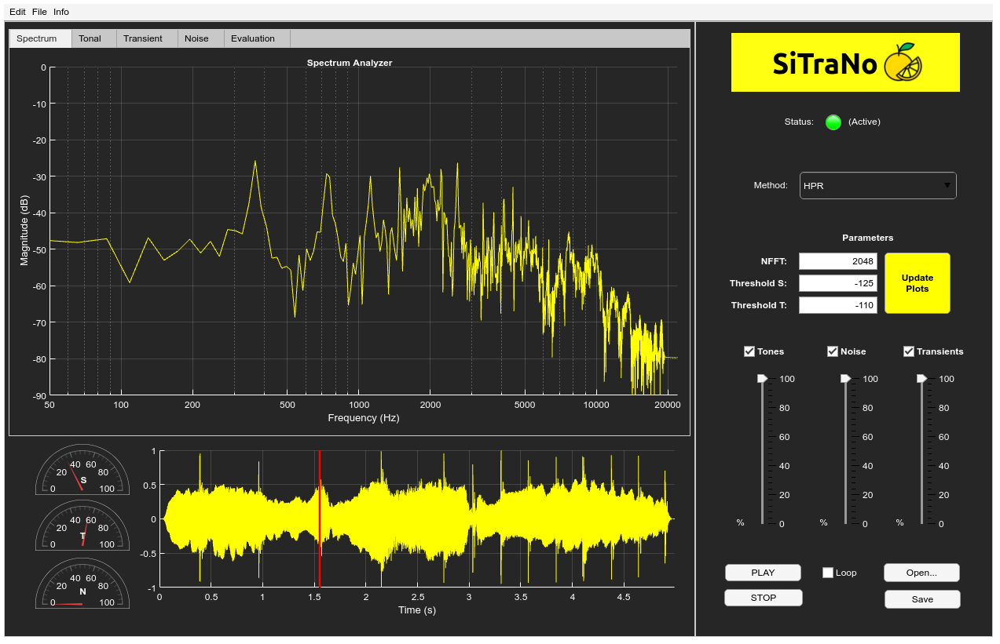

# SiTraNo
A MATLAB app for tonal-transient-noise decomposition of audio signals. Developed using App Designer in Matlab 2020b.

* [1] Fierro, L. and Välimäki, B. 2021. [**SiTraNo: a MATLAB app for tonal-transient-noise decomposition of audio signals**]. Submitted to Digital Audio Effects (DAFx) Conference 2021, Vienna, Austria.

## Abstract

Decomposition of sounds into their tonal, transient, and noise components is an active research topic and a widely-used tool in audio processing. Multiple solutions have been proposed in recent years, using time-frequency representations to identify either horizontal and vertical structures or orientations and anisotropy in the spectrogram of the sound. In this paper, we present SiTraNo: an easy-to-use MATLAB application with a graphic user interface for audio decomposition that enables visualization and access to the tonal, transient, and noise classes, individually. This application allows the user to choose between different well-known separation methods to analyze an input sound file, to instantaneously control and remix its spectral components, and to visually check the quality of the separation, before producing the desired output file. The visualization of common artifacts, such as birdies and dropouts, is demonstrated. This application promotes experimenting with the sound decomposition process by observing the effect of variations for each spectral component on the original sound and by comparing different methods against each other, evaluating the separation quality both audibly and visually.

## Dependencies

* Audio Toolbox
* Image Processing Toolbox

## Featured decomposition methods

* **HP** (Harmonic-Percussive separation).
* **HPR** (Harmonic-Percussive-Residual separation).
* **ST** (Structure Tensor)
* **Fuzzy** (Fuzzy)

## App description

Three panels.

## License

SiTraNo is distributed under the MIT Licence. Please refer to **LICENCE.md** for further information.
